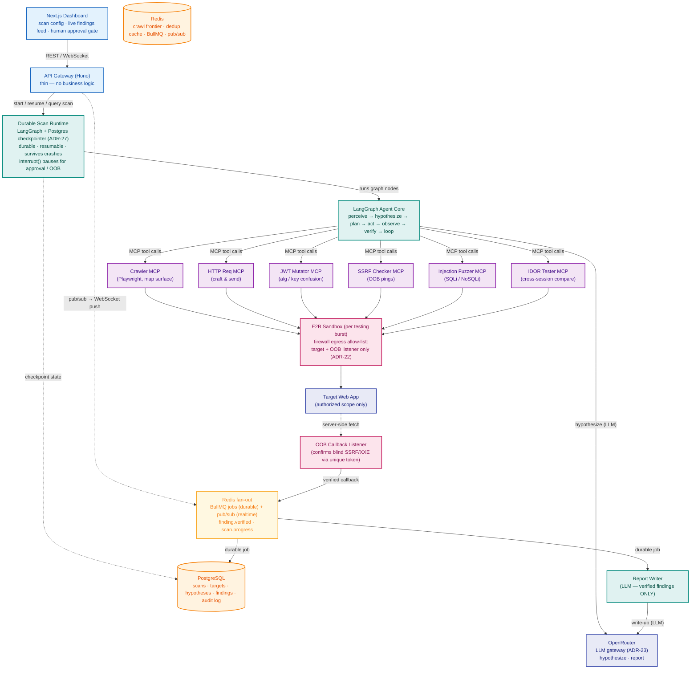
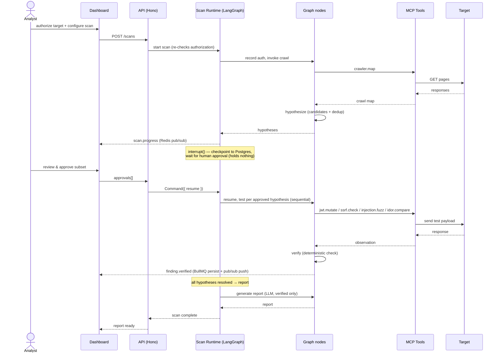
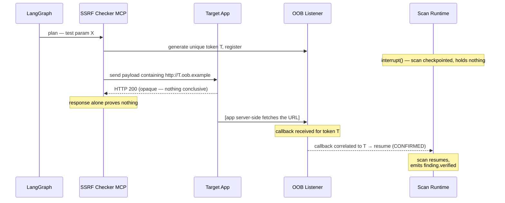
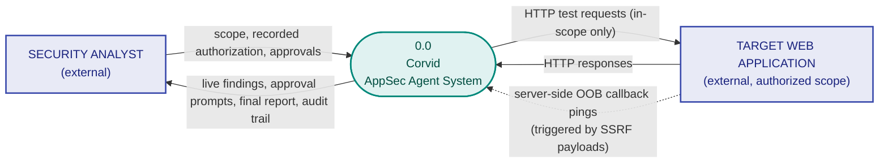
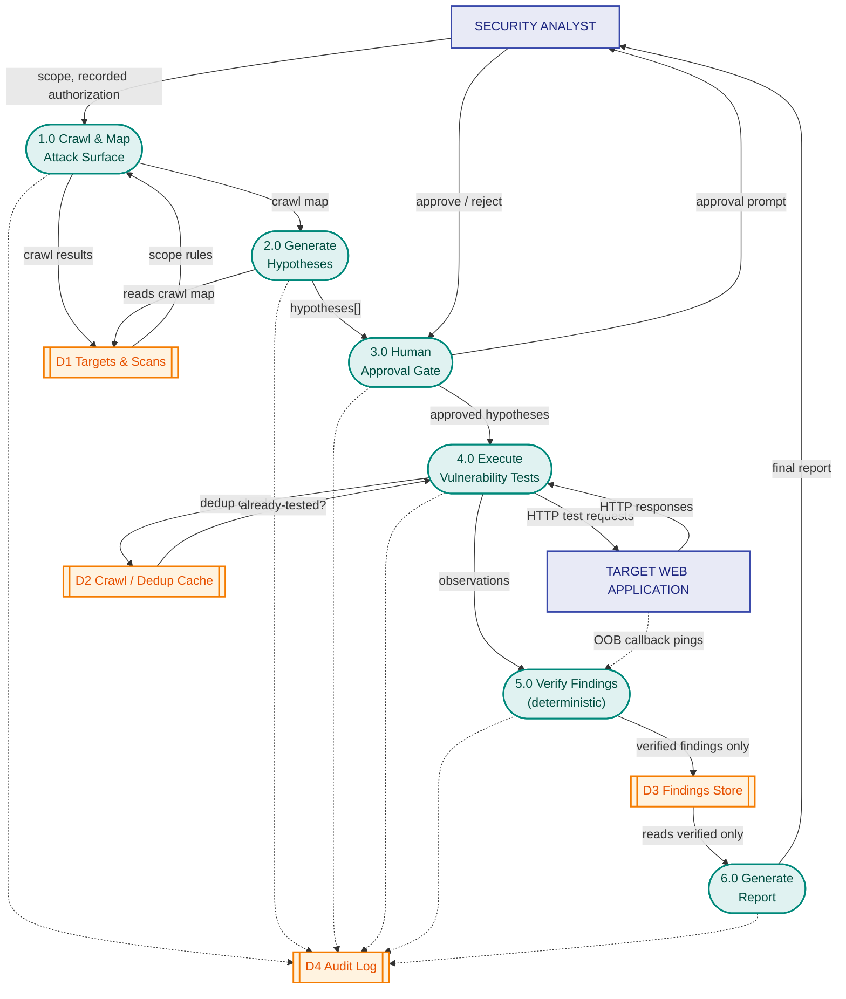
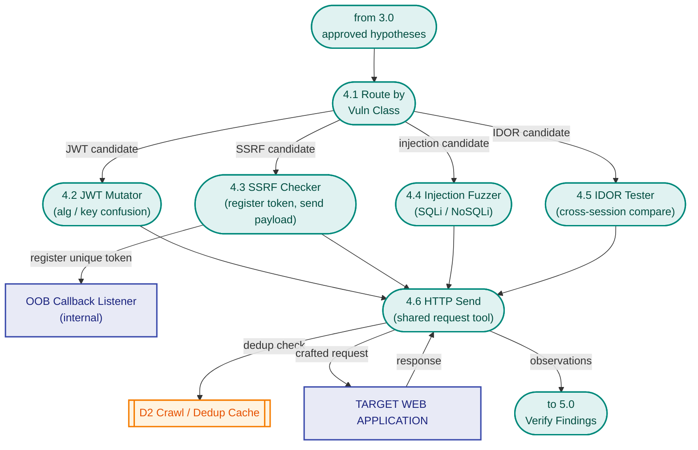
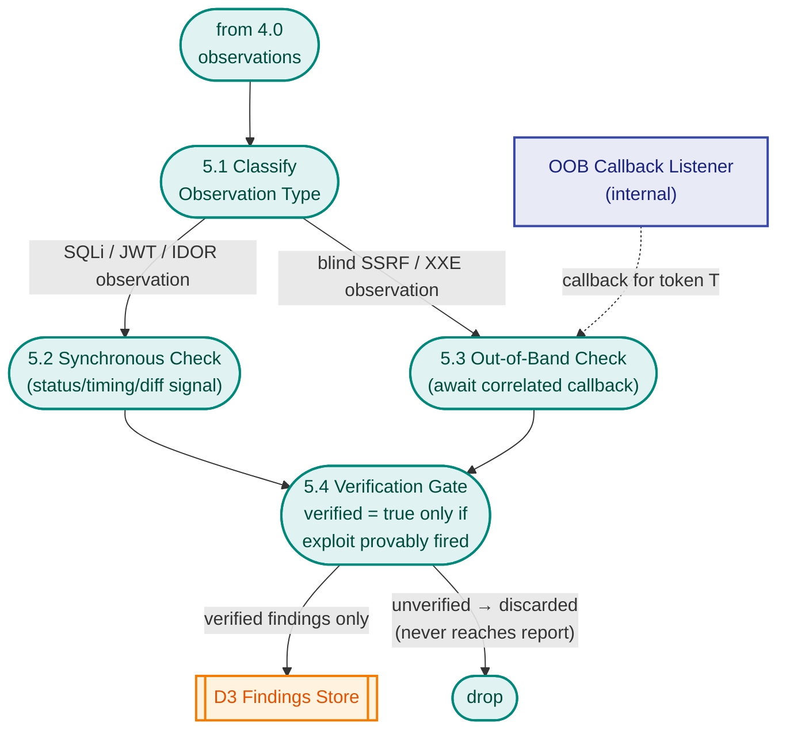
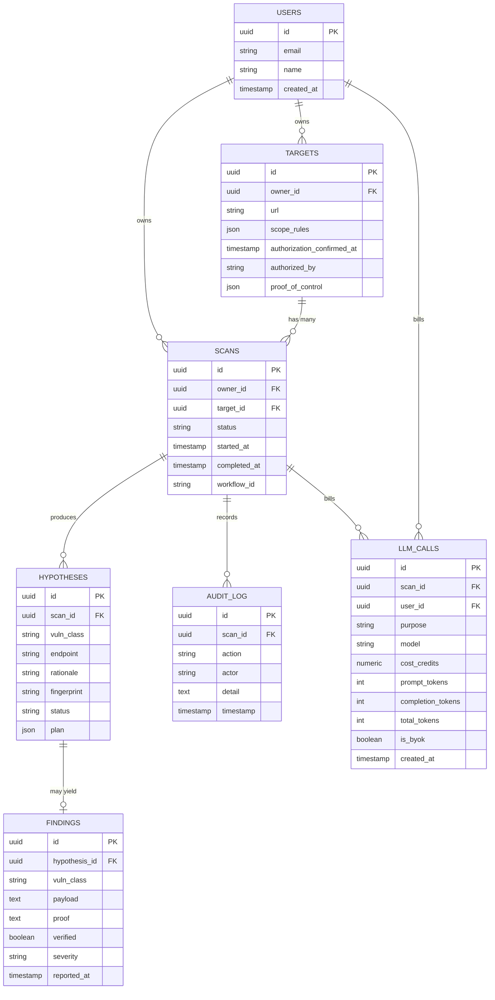
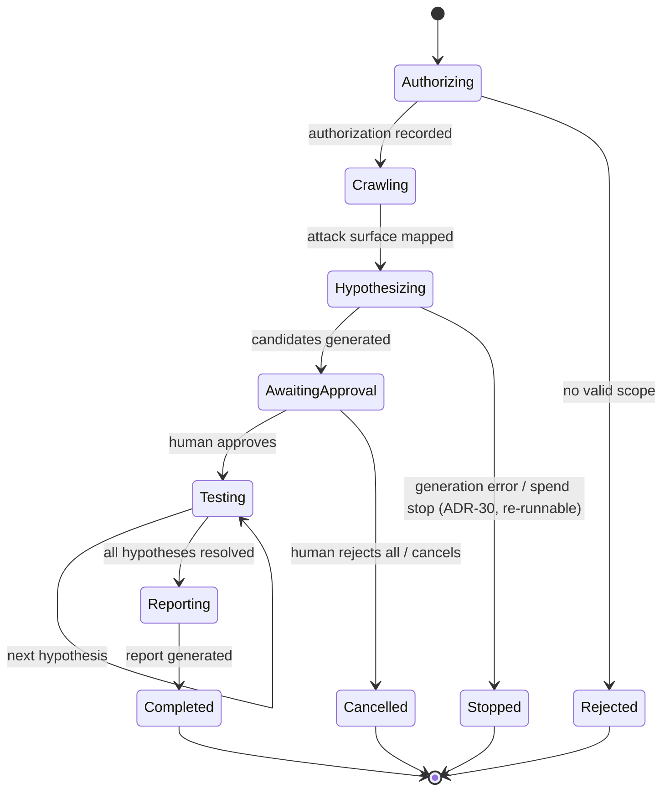

# Corvid — System Architecture

**`02`** · Companion docs: [`00_project_overview.md`](00_project_overview.md), [`01_product_ux_flow_spec.md`](01_product_ux_flow_spec.md)
**Status:** Spec v1 · **Last updated:** August 2026
**Scope:** components, sequence flows, data-flow diagrams, data model, integrations, security, and the technical decisions that implement `00` and `01`.

**Confirmed constraints going in:**
- **Verification is deterministic, never LLM-judged.** A finding is reported only after a non-LLM check proves the exploit fired (`00` §7.1).
- **No active testing without recorded authorization and human approval** (`00` §7.2–7.3), enforced in the workflow and at the sandbox egress layer.
- **Every scan runs in a per-scan sandbox** whose egress is allow-listed to the authorized target + the OOB listener only.
- **Stack (see `04`):** Next.js dashboard, Hono API gateway, LangGraph agent core + **durable scan runtime (LangGraph Postgres checkpointer, ADR-27 — no Temporal)**, MCP tool servers, PostgreSQL, Redis (dedup/frontier + BullMQ job queue + pub/sub fan-out, ADR-17), **E2B** per-scan sandbox (ADR-22), **OpenRouter** LLM gateway (ADR-23), self-hosted OOB listener.
- **Everything is TypeScript in one monorepo** (pnpm workspaces + Turborepo, ADR-18): `apps/*` deployables, `packages/*` shared code, with the MCP tool contracts as the load-bearing shared package.
- **Hosting (D-9 resolved, ADR-D9):** E2B for sandboxes; managed free tiers for Postgres + Redis (durability rides Postgres, no separate workflow service); a small always-on host (domain + wildcard DNS) for the OOB listener.

Where a decision wasn't settled upstream, it's marked **[Assumption]** with reasoning, so it's easy to override rather than silently baked in. Each is tracked as a D-## row in `03` §10.

---

## 1. Architecture style

Event-driven, workflow-orchestrated agentic system with four responsibility boundaries that must not blur:

- **Durable scan runtime (LangGraph + Postgres checkpointer, ADR-27)** owns the scan lifecycle and its durability — the reasoning graph and the lifecycle are one durable graph, checkpointed per node; the human-approval pause is a durable `interrupt()`, the OOB wait an `interrupt()` released by the listener or a periodic timeout sweep, retries are per-node. No Temporal.
- **Agent reasoning (LangGraph)** owns *what to do next* within a single step of that lifecycle.
- **Finding fan-out (Redis: BullMQ + pub/sub, ADR-17)** decouples "a finding was verified" from its consumers — durable BullMQ jobs for work that must not be lost (persist the finding, trigger the report), best-effort Redis pub/sub for the realtime dashboard feed. The audit log is not a consumer here: every process writes its audit record synchronously at the point of action (§4.2).
- **MCP tool servers** are the only components that touch the target network — the agent core never sends a raw request itself; it always delegates through a tool contract.

This separation is load-bearing, not cosmetic: the agent's reasoning can be tested independently of the network-touching tools, and each tool can be tested independently of the reasoning (replay a fixed hypothesis against the JWT Mutator without running the full LangGraph loop). It is the architectural expression of the tool-isolation principle (`00` §7.5).

**[Assumption]** The agent core and tool servers run as separate processes communicating over MCP within the per-scan sandbox; the API gateway, dashboard, scan-runtime worker, and datastores run outside it. Confirmed at Unit 1 (D-9).

---

## 2. Component diagram



**Why the agent never touches the network directly:** every request to the target originates in an MCP tool server running inside the egress-restricted sandbox. This keeps two guarantees testable in isolation — that the reasoning can't leak traffic, and that the traffic can't be sent outside the tool contract — and it is what makes the egress allow-list (§7) the actual, enforceable boundary rather than a hope about application behavior.

---

## 3. Sequence flows

### 3.1 Full scan — happy path



### 3.2 SSRF verification — async / out-of-band flow

This is the flow that justifies a *durable* pause over an in-memory wait: the gap between "payload sent" and "callback received" must not hold a thread, a connection, or in-memory state. A LangGraph `interrupt()` checkpoints the scan to Postgres and releases everything; the listener resumes it on a correlated callback, or the OOB-timeout sweep resolves it at the 5-minute D-4 bound (ADR-27).



If no callback arrives within the configured timeout (D-4, default 5 min), the **OOB-timeout sweep** resumes the interrupt with **not confirmed** rather than the scan hanging indefinitely (ADR-27/ADR-D4).

### 3.3 Human approval — pause/resume

```mermaid
sequenceDiagram
    participant Runtime as Scan Runtime (LangGraph)
    participant Dashboard
    actor Analyst

    Runtime->>Dashboard: emit — hypotheses ready for review
    Note over Runtime: interrupt() — checkpointed to Postgres;<br/>no polling, no thread held;<br/>waits indefinitely for resume
    Dashboard->>Analyst: render approval UI
    Analyst->>Dashboard: approve / reject per hypothesis
    Dashboard->>Runtime: Command({ resume: approvals[] })
    Note over Runtime: resumes exactly at the paused node;<br/>tests only approved hypotheses
```

---

## 4. Data flow diagrams (DFD)

Rendered in Mermaid. **Notation → shape mapping:** external entity = rectangle (blue); process = stadium (teal); data store = subroutine (orange).

### 4.1 DFD Level 0 — context diagram



Only two external entities cross the boundary: the analyst and the target. The OOB listener is *inside* the boundary (the system operates it) even though the callback physically arrives from the target's infrastructure — shown as the dotted flow.

### 4.2 DFD Level 1 — process decomposition



> Dotted arrows to **D4 Audit Log** indicate every process writes an audit record (actor, action, timestamp) — no process is exempt.

### 4.3 DFD Level 2 — process 4.0 "Execute Vulnerability Tests"



### 4.4 DFD Level 2 — process 5.0 "Verify Findings"

Shows why verification is deterministic, not LLM-judged — the architectural heart of the product. The **per-class signal + false-positive guard** for each is a resolved decision (methods in `04` ADR-D13–D16; thresholds calibrated on the labs in Unit 5): JWT = three-way none/valid/forged auth-state oracle; injection = error signature / **dose-response** timing / boolean-differential; IDOR = labeled cross-session ownership proof with controls; SSRF = correlated OOB callback (preferred) or a unique server-fetched canary — never a reflected input, and never an in-sandbox socket result (ADR-22).



### 4.5 Data store definitions

| Store | Contents | Backing tech |
|---|---|---|
| D1 — Targets & Scans | target URL, scope rules, authorization timestamp, scan status, hypotheses | PostgreSQL |
| D2 — Crawl / Dedup Cache | crawl frontier queue, already-tested hypothesis fingerprints | Redis |
| D3 — Findings Store | vuln class, payload, proof artifact, verified flag, severity | PostgreSQL |
| D4 — Audit Log | every action taken, by actor (agent or human user id), with timestamp | PostgreSQL |

---

## 5. Data model



- `status` on `hypotheses`: `pending → approved | rejected → tested → confirmed | not_confirmed`.
- `verified` on `findings` is the **single gate** the Report Writer checks — no other field is sufficient to include a finding in a report.
- `fingerprint` on `hypotheses` is what the Redis dedup cache keys on so a hypothesis already tested in a scan is never re-sent — `hash(vuln_class + normalized method+path + param + payload family)` (D-10 resolved, ADR-D10). A **unique `(scan_id, fingerprint)` index** makes hypothesis persistence a replay-safe upsert (`onConflictDoNothing`), the durable counterpart to the Redis cache (ADR-27).
- `plan` on `hypotheses` (jsonb, ADR-30, Unit 3): the structured test plan the reasoning core writes — `method` / `param` / `payload family` at hypothesize time, extended by the `plan` node with the selected tester and the human-readable **intended payload** shown at the approval gate (§6). Validated at the service layer (`hypothesisPlanSchema`).
- `llm_calls` (ADR-21, Unit 3): the per-call LLM spend ledger. Each `hypothesize`/report call writes one row at the call site; the daily hard-stop sums `cost_credits` for the current UTC day, globally and per user (`user_id` denormalized so the per-user cap is a direct sum). `cost_credits` is null when the gateway doesn't report it (e.g. BYOK). `scan_id`/`user_id` are plain FKs (like `audit_log`), so spend history outlives the scan.
- `severity` on `findings` is a **CVSS 3.1 base score + vector string** (D-3 resolved, ADR-D3); the Critical/High/… band is derived from the score at read time, not stored.
- **Tenancy (ADR-19):** `users` is Better Auth's identity table; `targets` and `scans` carry `owner_id`, and every query for a target/scan/hypothesis/finding/audit row is scoped to the owning user. There is no cross-tenant read path — isolation is enforced in the data layer, not by UI absence. v1 is single-user; org/team tenancy is a V2 upgrade via Better Auth's organization plugin (`05`).
- `proof_of_control` on `targets` records the evidence that the owner actually controls the target (D-7 / ADR-D7) — the anti-abuse counterpart to `authorization_confirmed_at`, so a recorded authorization can't be a bare self-assertion.
- **Target credentials (D-1 resolved):** the analyst-supplied crawl-auth login, sample JWT, and the two IDOR-session credentials are stored **encrypted at rest, scoped to the scan/target**, decrypted only transiently at use (§7). They belong to a scan's configuration, never logged, and are the inputs the crawler, `jwt.mutate_test`, and `idor.compare` consume.

### 5.1 Scan lifecycle — state diagram

The `scans.status` field over the life of a scan.



---

## 6. REST API surface (consumed by the dashboard)

The gateway is thin (`00` §8): each handler resolves auth, validates input, calls a core service or signals the workflow, and shapes the response. No business logic lives here.

**Every endpoint below is session-authenticated (Better Auth, ADR-19) and owner-scoped** — a request resolves to exactly one `users.id`, and a target/scan not owned by that user is a 404, not a 403 (no cross-tenant existence leak). Mutating endpoints and the auth surface are rate-limited per user (ADR-20). Better Auth mounts its own routes under `/api/auth/*`.

| Endpoint | Purpose |
|---|---|
| `/api/auth/*` | Sign-up / sign-in / session (Better Auth, ADR-19) |
| `POST /targets`, `PATCH /targets/:id` | Create/edit a target + scope rules; editing scope invalidates authorization (`01` §3) |
| `POST /targets/:id/authorize` | Record explicit authorization **with proof-of-control** (mechanism per D-7); stamps actor + timestamp |
| `GET /targets`, `GET /targets/:id` | Target list + detail with authorization status |
| `POST /scans` | Start a scan — re-checks authorization at workflow start, and enforces the per-user concurrent-scan cap (ADR-20); not trusted from the UI |
| `GET /scans`, `GET /scans/:id` | Scan list + live lifecycle state |
| `GET /scans/:id/hypotheses` | Hypotheses awaiting approval, with rationale + intended payload |
| `POST /scans/:id/approvals` | Signal the workflow with per-hypothesis approve/reject |
| `POST /scans/:id/cancel` | Cancel a paused or running scan |
| `GET /scans/:id/findings` | Verified findings (streamed live via WebSocket; REST for history) |
| `GET /scans/:id/report` | The verified-only report (`01` §9) |
| `GET /scans/:id/audit` | Complete per-scan audit trail (`01` §10) |

---

## 7. Security considerations

This section is load-bearing — the system sends active test payloads at live applications and must never do so outside recorded authorization. Two families of control: *target-facing* (don't attack anything unauthorized) and *platform-facing* (don't let Corvid be abused, drained, or crossed between tenants).

- **Authenticated, owner-scoped, isolated (ADR-19).** Every request resolves to one `users.id` via a Better Auth session; every target/scan/hypothesis/finding/audit query is scoped to that owner with no cross-tenant read path — enforced in the data layer, verified by direct calls, not UI absence. A not-owned resource is a 404, not a 403.
- **Proof-of-control on authorization (D-7).** Recording authorization requires evidence the authenticated user controls the target, not a self-asserted checkbox — the control that stops an authenticated user aiming Corvid at a target they don't own.
- **Platform abuse controls (ADR-20).** Per-user API rate limits on mutations + the auth surface, and a per-user concurrent-scan cap checked at workflow start (the bound on sandbox/worker exhaustion). Config-driven (D-11), failing closed with a typed refusal, never a silent drop.
- **LLM spend kill-switch (ADR-21).** Hypothesis generation and report writing record per-call cost at the call site; a daily global + per-user hard-stop (D-12) refuses further LLM-billed calls once tripped. Because the verification gate is non-LLM, this degrades reasoning throughput, never finding integrity.
- **Authorization is enforced twice, at two layers.** (1) The workflow refuses to leave `Authorizing` without a valid `authorization_confirmed_at` for the exact current scope. (2) The sandbox egress allow-list is derived from that same scope, so even a bug in the agent cannot reach an out-of-scope host. Defense-in-depth by design — neither layer trusts the other to be correct.
- **Sandbox egress is allow-listed at the firewall level (E2B, ADR-22).** Each active-testing burst runs in an E2B sandbox created with `denyOut: all` + `allowOut: [target host(s), OOB listener]`. A denied egress attempt is recorded in the audit log and flags the hypothesis that produced it (`01` §12) — an in-scope tool trying to leave scope is itself a signal. **Caveat (ADR-22):** E2B can make a blocked connection *look* open from inside the sandbox, so reachability is judged by an application-level/OOB signal, never a socket open — which is the verification rule anyway (ADR-01).
- **Egress is host-level; path-level scope is enforced in `http.send` (ADR-24).** The firewall can't see a path inside TLS, so an in-scope host with an out-of-scope path would pass egress. `http.send` checks every request's full URL against scope before sending and refuses + audits an out-of-scope-path attempt. Host at the firewall, path in the one shared HTTP tool — two layers again.
- **The verification gate is non-LLM and deterministic** (§4.4). The Report Writer reads `findings.verified = true` only and has no path to raw agent reasoning. There is no code path by which an LLM's opinion becomes a reported finding.
- **Everything is audited.** Every process writes an audit record with actor (agent node or human user id), action, timestamp, and payload detail. No process is exempt (§4.2). The audit log is append-only.
- **Least-privilege everywhere the system holds power over a target.** Test credentials (the IDOR accounts, D-1) are scoped to the target and stored encrypted at rest, decrypted only transiently at use. OOB tokens are single-use and correlated per test.
- **Secrets and target-sensitive data never reach a log line.** Test credentials, encryption keys, and raw response bodies that may contain sensitive target data are excluded from logging structurally, not by vigilance (`CODING_STANDARDS.md` §5).
- **Rate-limiting against the target** is bounded per the D-2 posture so authorized testing does not degrade the target or trip its WAF/IDS; the limit is enforced in the shared HTTP tool (§4.3), not left to each tester.

**[Assumption]** Encryption at rest for test credentials uses an application-level key supplied via environment/secret store (no cloud-KMS dependency in v1). Confirmed at Unit 1 (D-9).

---

## 8. Background jobs / durability

| Concern | Mechanism |
|---|---|
| Scan lifecycle (pause/resume/retry) | Durable LangGraph scan graph + Postgres checkpointer (ADR-27) — checkpoint per node survives process/container crashes; per-node `retryPolicy` for retries |
| Human approval wait | LangGraph `interrupt()` — scan checkpointed to Postgres, nothing held, resumed via `Command` days later even across a deploy (§3.3) |
| OOB callback wait | LangGraph `interrupt()` released by the OOB listener on a correlated callback, **or by the OOB-timeout sweep** at the 5-min D-4 bound → "not confirmed" (§3.2) |
| OOB-timeout sweep | Periodic job: resumes any OOB interrupt older than the D-4 timeout with "not confirmed"; also the backstop that no paused scan lingers forever (replaces a durable timer, ADR-27) |
| Crawl frontier | Redis queue consumed by the Crawler MCP; dedup cache keyed on hypothesis fingerprint (D-10) |
| Finding fan-out | Redis (ADR-17) — `finding.verified` triggers durable BullMQ jobs (persist the finding, trigger report generation) so a consumer restart loses nothing; Redis pub/sub pushes `scan.progress` + live findings to the dashboard best-effort. The audit log is written synchronously at the action, not via the bus (§4.2) |
| Sandbox lifecycle (ADR-22) | Ephemeral **E2B** sandbox scoped to the **active-testing burst** — created *after* approval, destroyed when testing ends. It does **not** span the whole scan: E2B caps lifetime (1h Hobby / 24h Pro), and scans pause for approval (days) and OOB waits (up to D-4), which hold no sandbox. Egress allow-list (`denyOut: all` + `allowOut: [target, OOB]`) applied at create |
| LLM spend tracking (ADR-21) | Per-call cost recorded at the generation/report call site; a daily rollup + hard-stop (global + per-user, D-12) refuses LLM-billed calls once tripped, reset at UTC midnight — reads the same cost rows it writes, no separate job |

**Why a durable checkpointer and not an in-memory wait (ADR-27):** the wait between "SSRF payload sent" and "callback received" (§3.2), and between "hypotheses ready" and "human approves" (§3.3), can be seconds to days and must survive a crash without losing scan state. LangGraph's `interrupt()` + Postgres checkpointer meets exactly that — the scan is serialized to Postgres and resumed by whatever process holds the scan id, at an arbitrary later time. We deliberately do **not** run Temporal: its one irreplaceable feature is long durable timers, and D-4 bounds the only timed wait (OOB) to 5 minutes, which the sweep covers. Two things this makes load-bearing: **node idempotency** (a resumed node re-runs from its start; `http.send` dedup makes a replayed payload safe — our substitute for exactly-once) and **checkpoint-store discipline** (it's production data — back it up; a code change can make an old checkpoint unresumable — see `CODING_STANDARDS.md` §14). BullMQ (ADR-17) is a separate concern — durable *fan-out* of a verified finding — not lifecycle orchestration.

---

## 9. Environments & deployment

**Resolved (D-9, 2026-08-10 — ADR-22/ADR-27/ADR-D9), split by concern:**
- **Sandboxes → E2B** (ADR-22): ephemeral Firecracker microVMs, egress allow-list at E2B's firewall, TS SDK. Scoped to the active-testing burst (§8), free credits for v1.
- **PostgreSQL + Redis → managed free tiers.** Durability rides Postgres via the LangGraph checkpointer (ADR-27) — **no separate workflow service** (Temporal removed), one fewer thing to host, state consolidated.
- **OOB listener → one small always-on host** with a domain + wildcard DNS — the one piece needing public inbound + DNS control that free app-tiers can't provide.
- **Secrets** (analyst-supplied target credentials, encryption key) live in each service's environment/secret store; no cloud-KMS dependency in v1.

The API gateway (Hono), dashboard (Next.js), and scan-runtime worker run as long-lived services on a free app tier. No single free platform does egress-controlled microVMs *and* wildcard-DNS inbound, so those two go where each is capable; everything stateful is Postgres/Redis managed tiers.

---

## 10. MCP tool contracts

The agent core embeds no vuln-specific logic; each capability is an MCP tool server with a stable, versioned contract (`00` §7.5).

| Tool | Input | Output | Notes |
|---|---|---|---|
| `crawler.map` | target URL, analyst-supplied login creds | endpoint list, params, auth-flow map | Playwright-driven; uses D-1 crawl-auth creds to map authenticated surface; respects scope boundaries |
| `http.send` | method, url, headers, body | status, headers, body, timing | Generic request tool used by all testers; enforces dedup, rate posture, and **path-level scope (ADR-24)** — refuses + audits an out-of-scope-path request; sequential per scan (ADR-25) |
| `jwt.mutate_test` | analyst-supplied sample JWT, target endpoint | mutation tried, resulting auth state | `alg: none`, HS/RS confusion, key reuse (D-1 sample token) |
| `ssrf.check` | candidate param, OOB token | pending → confirmed / timeout | Registers token with the OOB listener, awaits correlated callback |
| `injection.fuzz` | param, injection class | payload tried, response signal (error/time/diff) | SQLi (error + time-based), NoSQLi |
| `idor.compare` | endpoint, the two analyst-supplied sessions | cross-session access outcome | Compares behavior across the two privilege levels (D-1); ownership labeling per D-15 |

- Contracts are **additive-only** once published; a change to an existing tool's input/output shape is a compatibility decision, not a refactor (`CODING_STANDARDS.md` §9).
- Every tool call is audited (§4.2) and every request the tool sends is dedup-, rate-, and **path-scope**-checked in `http.send` (§4.3, ADR-24).
- **Target credentials (D-1 resolved):** the crawl-auth login, the JWT sample, and the two IDOR sessions are all analyst-supplied at scan config, stored encrypted, target-scoped (§7) — Corvid never provisions accounts on the target.

---

## 11. Non-functional requirements

| Concern | Approach |
|---|---|
| **Reliability** | The LangGraph Postgres checkpointer (ADR-27) persists scan state per node, so a crash resumes at the last completed node; per-node `retryPolicy` for retries; node idempotency + `http.send` dedup make a replayed node safe |
| **Safety (of the tool itself)** | Sandboxed, egress-restricted execution per scan; no shared state between concurrent scans of different targets; authorization enforced at two layers (§7) |
| **Scalability** | BullMQ on Redis (ADR-17) decouples finding-detection from its durable consumers; multiple scan workflows run concurrently, each active-testing burst in its own E2B sandbox (ADR-22). Sufficient for v1's single-target scans — a heavier bus is a `05` B2 concern only if throughput ever demands it |
| **Observability** | `audit_log` gives a full action trail per scan; a Redis pub/sub `scan.progress` channel feeds the real-time dashboard |
| **Auditability** | Every finding traces back through hypothesis → scan → target, with the exact payload and proof stored |

---

## 12. Open technical decisions / TODOs

Reasoning of record for each is an ADR in `04`. **All specs-level decisions are resolved; only value knobs remain open.**

- ~~**D-1**~~ **Resolved** — target credentials analyst-supplied at scan config, encrypted, target-scoped (ADR-D1).
- ~~**D-2**~~ **Resolved** — conservative default rate + adaptive backoff on 429/403/WAF in `http.send`, analyst-overridable; values config (ADR-D2, §4.3, §7).
- ~~**D-3**~~ **Resolved** — CVSS 3.1 base score + vector on `findings.severity` (ADR-D3, §5).
- ~~**D-4**~~ **Resolved** — 5-min OOB wait via the timeout sweep; late callback = audit note only (ADR-D4, §3.2, §8).
- ~~**D-9**~~ **Resolved** — E2B sandboxes (ADR-22) + managed Postgres/Redis; durability via the LangGraph checkpointer (ADR-27, no Temporal); small box for the OOB listener (ADR-D9, §9).
- ~~**D-10**~~ **Resolved** — fingerprint = `hash(vuln_class + normalized method+path + param + payload family)` (ADR-D10, §5, §8).
- **D-11** *(values only)* — API rate-limit + concurrent-scan-cap numbers (mechanism = ADR-20; §6, §7); conservative config defaults, tuned post-launch.
- **D-12** *(values only)* — LLM daily spend ceilings (mechanism = ADR-21; §7, §8); conservative defaults raised after Unit 8 measures cost.
- ~~**D-13–D-16**~~ **Methods resolved** — per-class verification signals (ADR-D13–D16, §4.4); numeric *thresholds* calibrated on the practice labs in Unit 5.
