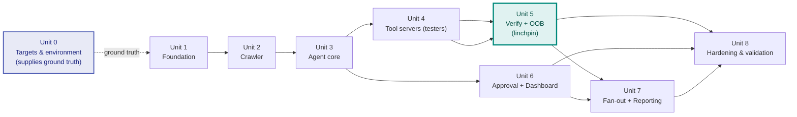

# Corvid — Build Plan

**`03`** · Companion docs: [`00_project_overview.md`](00_project_overview.md), [`01_product_ux_flow_spec.md`](01_product_ux_flow_spec.md), [`02_system_architecture_spec.md`](02_system_architecture_spec.md), [`04_design_decisions_log.md`](04_design_decisions_log.md), [`../CODING_STANDARDS.md`](../CODING_STANDARDS.md)
**Status:** Spec v1 · **Last updated:** August 2026
**Source of truth for:** what gets built, in what units, with which open decisions each unit is responsible for closing. Execution progress against this plan lives in [`../progress-tracker.md`](../progress-tracker.md).

---

## 0. How to use this document

Execution is organized as **units, not phases**. A phase implies a strict linear sequence; this project doesn't have one. After the foundation exists, several fronts (tool servers, dashboard, event pipeline) are genuinely independent and can proceed in parallel or in whatever order external prerequisites (practice targets, a real authorized target) allow. A unit is a coherent slab of work that retires one kind of risk, has explicit dependencies on other units (a DAG, not a line), and ends with its own definition of done.

The second job of this document, borrowed from how `00`–`02` were written: **nothing defaults silently.** `00`–`02` marked every undecided point as **[Assumption]** or listed it as an open question (`00` §13, `01` §13, `02` §12). Every one has a named home in exactly one unit below, and the master table in §10 is the single place to check that none was forgotten. Each row's reasoning of record is an ADR in `04`. When a unit resolves one, four small writes happen together: a log entry in `../progress-tracker.md`, its ADR in `04` updated with what was decided, the §10 row flipped to Resolved, and the originating spec doc's [Assumption] marker updated — so the specs never silently drift from what was built.

One product decision governs sequencing more than any other: **verification is the whole product** (`00` §11). A finding the system can't deterministically prove is worse than no finding. So the loop is proven **narrow and end-to-end first** — crawler + one tester (JWT) + the deterministic verification gate against a single seeded practice target (Unit 5's early slice) — before breadth (the other three classes) or polish (dashboard, reporting) is built on top. If the verification gate can't be trusted, nothing else matters, and we want to know that as early as possible against a known-vulnerable lab.

Three process conventions from `CODING_STANDARDS.md` apply to every unit rather than belonging to any one: external library usage verified against official docs before coding against it (the MCP spec, LangGraph.js, E2B, and Playwright all move fast); a **security & safety review at the end of every unit**, findings fixed before any dependent unit builds on top; and — unique to this product — **no unit's DoD is met while any code path can send an active payload outside recorded authorization or report an unverified finding.** Those two are launch-blocking invariants, not quality goals.

---

## Unit 0 — Authorization, Targets & Environment Prerequisites

**Retires the risk of:** having nothing legitimate to test. The v1 success metrics (`00` §10) depend on seeded practice labs *and* at least one real authorized target, plus the infrastructure the sandbox and OOB verification need. Lead time on a real authorized target (a bounty program's scope, a lab's provisioning) is partly external, so this starts day one and runs alongside everything.

### What gets done
- Stand up / select **seeded practice targets** with known vulnerabilities across all four classes (JWT confusion, SSRF incl. blind, injection, IDOR) — the ground truth for precision/recall.
- Secure a **real, authorized target** (practice lab or in-scope bounty program) with recorded scope, for the one-real-finding metric. Authorization recording mechanism is D-7's subject.
- Register an **OOB domain** with wildcard DNS and stand up the callback listener's always-on host (the D-9 "small box"; free app-tiers can't serve wildcard-DNS inbound).
- Provision **OpenRouter access** (ADR-23) for hypothesis generation + report writing, and record a first-pass cost-per-scan estimate (feeds the D-12 spend ceilings).
- Provision the resolved-D-9 infrastructure: an **E2B account** (ADR-22, free credits) for sandboxes, and **managed free tiers** for Postgres + Redis (durability rides Postgres via the LangGraph checkpointer, ADR-27 — no separate workflow service).

### Decisions owned
None — this unit executes and supplies ground truth (real scopes, real target behavior, measured LLM cost) that D-12 and the Unit 8 validation need.

### Definition of done
- Practice targets reachable, with a documented list of seeded vulns per class (the answer key for recall).
- At least one real authorized target with recorded scope and authorization.
- OOB domain + wildcard DNS live on its host; OpenRouter key working; E2B account + managed Postgres/Redis reachable.

---

## Unit 1 — Foundation

**Retires the risk of:** structural plumbing that is expensive to unwind later — repo shape, database schema, the durable scan-runtime wiring, the audit log, config/secrets, **platform auth and tenant isolation** — and of the tool-isolation and two-layer-authorization principles (`02` §1, §7) eroding before they ever exist.

### What gets built
- Repo scaffold per `CODING_STANDARDS.md` §2 (ADR-18): a **TypeScript monorepo on pnpm workspaces + Turborepo** — `apps/*` deployables (thin Hono gateway, agent core + scan-runtime worker, tool servers, dashboard, OOB listener), `packages/*` shared code with the MCP tool contracts as their own package; strict TS, one `tsconfig` base, Turborepo task pipelines for `build`/`test`/`lint`/`typecheck`.
- **Platform authentication (Better Auth, ADR-19)** and **single-user tenant isolation**: email/password + provider sign-in, dashboard sessions; every domain row (`targets`, `scans`, `hypotheses`, `findings`, `audit_log`) scoped to an owning user, and every request resolved to exactly one user with **no cross-tenant read path**. This is built here because the authorization gate (ADR-03) is only meaningful once "who authorized this" is a real, authenticated identity.
- **PostgreSQL** provisioned; the full `02` §5 schema migrated from day one: `users` (Better Auth), `targets`, `scans`, `hypotheses`, `findings`, `audit_log`, all owner-scoped. The **append-only audit log built here**, because every later unit writes to it.
- **Durable scan runtime (LangGraph + Postgres checkpointer, ADR-27)** as the scan-lifecycle owner: a skeleton scan graph with the `02` §5.1 state machine, a **durable `interrupt()` for the approval pause** (resumed via `Command`), and the **OOB-timeout sweep** stub for the D-4 wait — no real testing yet, but the durable spine exists and survives a process restart mid-pause. No Temporal.
- **Per-scan sandbox skeleton on E2B (ADR-22):** an ephemeral E2B sandbox created with `denyOut: all` + `allowOut: [target host(s), OOB domain]` derived from the target's scope, plus the two-layer authorization check (§7) — workflow refuses to start without recorded authorization; the E2B firewall denies out-of-scope egress. **Lifecycle = active-testing burst, not whole scan** (E2B's 1h/24h cap can't span an approval pause), so the skeleton proves create-after-approval / teardown-after-testing here. Safety-critical machinery built once, before any tool can send a payload.
- **Platform abuse controls (ADR-20):** per-user API rate limiting on the gateway (mutations + auth surface) and a per-user concurrent-scan cap checked at workflow start, both config-driven (D-11). Distinct from the target-facing rate posture (D-2) — this protects Corvid, not the target.
- Env validation at startup, structured logger with the §5 secret/target-data hygiene, error-class hierarchy.

### Decisions owned
- **D-9** — **Resolved (ADR-22/ADR-27/ADR-D9):** E2B sandboxes + managed Postgres/Redis; durability via the LangGraph Postgres checkpointer (no Temporal); a small box for the OOB listener. This unit wires it.
- **D-11** — platform abuse-control limit values: API rate-limits + per-user concurrent-scan cap (mechanism = ADR-20; values tunable post-launch).

### Dependencies
None (Unit 0 proceeds in parallel).

### Definition of done
- A user can sign up / sign in; **user A cannot read or act on user B's targets, scans, findings, or audit records** — verified by direct API calls, not UI absence.
- A scan can be started, moves through the `02` §5.1 states against a stub, pauses at the approval `interrupt()`, and resumes via `Command` — **surviving a scan-runtime restart mid-pause** (the LangGraph Postgres checkpointer proven durable, not assumed; ADR-27).
- The workflow **refuses to start** for a target with no recorded authorization; the message names the reason.
- The E2B sandbox **denies an out-of-scope egress attempt** at the firewall level, and the denial lands in the audit log — proven with a deliberate out-of-scope request, not asserted. Because E2B can make a blocked connection *look* open from inside (ADR-22), the test asserts on an application-level signal, never a socket open.
- API rate limits and the per-user concurrent-scan cap (ADR-20) refuse excess with a typed retry-after / cap-reached response, never a silent drop or a 500.
- Env validation fails fast on a missing required var.
- **Security & safety review passed** (auth + cross-tenant isolation, authorization double-check, egress allow-list actually holds, audit log append-only, secrets in env only, abuse limits enforced) — findings fixed before Units 2+ start.

---

## Unit 2 — Crawler & Attack-Surface Mapping

**Retires the risk of:** the agent reasoning about an attack surface it mapped incompletely or that it mapped outside scope. Passive and autonomous (`01` §5) — no payloads — so it's the safe first thing to point at a real target.

### What gets built
- **Crawler MCP** (`crawler.map`, `02` §10): Playwright-driven, handles JS-rendered SPAs and multi-step auth flows; emits endpoints, params, and an auth-flow map.
- **Redis** crawl frontier queue + the dedup-cache foundation (`02` §8).
- Scope enforcement inside the crawl: the crawler cannot enqueue an out-of-scope URL, and the sandbox egress layer is the backstop if it tries.

### Decisions owned
None new — executes `02` §10's crawler contract.

### Dependencies
Unit 1 (schema, sandbox, audit log). Can point at Unit 0's practice targets immediately.

### Definition of done
- Against a seeded practice target, the crawler produces an endpoint/param/auth-flow map a human agrees is reasonably complete.
- A crawl never issues an out-of-scope request (verified by the audit log across a run), and an empty-surface target completes cleanly (`01` §5).
- **Security & safety review passed** (scope enforcement, no payloads sent, no target data in logs).

---

## Unit 3 — Agent Core (perceive → hypothesize → plan)

**Retires the risk of:** the reasoning loop being an opaque prompt chain rather than an inspectable, testable state machine (`00` §8). This is where the LLM's role — and its strict boundary — is established: it hypothesizes and plans; it never verifies.

### What gets built
- **LangGraph agent core** as named, individually testable nodes: `perceive` (consume the crawl map), `hypothesize` (LLM proposes candidate vulns as vuln-class + endpoint + rationale), `plan` (select tool + payload for a hypothesis). The `act/observe/verify` nodes are stubbed here and filled by Units 4–5.
- **Hypothesis generation** persisted to `hypotheses` with a `fingerprint` and dedup against the Redis cache (D-10).
- **LLM via OpenRouter (ADR-23):** the `hypothesize` call goes through the OpenRouter client (model slugs live only in that client; call sites pass a purpose). **Cost recording + spend kill-switch (ADR-21):** per-call cost recorded at the call site from OpenRouter's returned metadata; a daily hard-stop (global + per-user, D-12) refuses further LLM-billed calls with a retryable error once tripped. Because the verification gate is non-LLM (ADR-01), a spend stop degrades reasoning throughput, never finding integrity.
- Malformed/empty LLM output handled as a visible generation error that pauses the scan, never proceeds on garbage (`01` §12).

### Decisions owned
- **D-10** — **Resolved (ADR-D10):** fingerprint = `hash(vuln_class + normalized method+path + param + payload family)`; path-normalization/family buckets calibrated on the labs.
- **D-12** — LLM daily spend ceiling values, global + per-user (mechanism = ADR-21; raised deliberately once Unit 8 measures real per-scan cost).

### Dependencies
Unit 1, Unit 2 (crawl map to reason over).

### Definition of done
- Given a real crawl map, the agent produces plausible, deduped hypotheses across the four classes, each with a rationale a human can evaluate at the approval gate.
- Each LangGraph node is unit-testable in isolation against a fixture (no live target, no network).
- Re-running hypothesis generation on the same crawl map dedups rather than duplicating.
- A generation call is refused with a retryable error once the spend hard-stop (ADR-21) is tripped — surfaced to the scan, never a silent proceed-on-empty; cost is recorded even when the LLM output fails to parse.
- **Security & safety review passed** (LLM output validated before persistence; no path from hypothesis text to an auto-sent payload without approval; spend recorded at the call site).

---

## Unit 4 — MCP Tool Servers (the testers)

**Retires the risk of:** vuln-class logic leaking into the agent core, and of each tester being untestable without the whole loop. Each capability is an independent MCP server (`00` §7.5, `02` §10).

### What gets built
- **`http.send`** shared request tool — the single place every tester's traffic flows through, enforcing dedup, the per-target rate posture (D-2), and **path-level scope (ADR-24):** every request's full URL is checked against scope before sending (the E2B firewall only enforces the host); an out-of-scope-path attempt is refused and audited like a denied egress. Testing is **sequential within a scan (ADR-25).**
- **`jwt.mutate_test`** — `alg: none`, HS/RS confusion, key reuse; uses the analyst-supplied sample JWT (D-1).
- **`injection.fuzz`** — SQLi (error + time-based) and NoSQLi payloads, emitting the response signal (error/timing/diff) for the verifier.
- **`ssrf.check`** — registers a unique OOB token and sends the referencing payload (verification is Unit 5's).
- **`idor.compare`** — issues the same request under the two analyst-supplied sessions at different privilege (D-1).
- Every tool emits structured observations for the verification gate; none of them decides "verified."

### Decisions owned
- **D-2** — **Resolved (ADR-D2):** conservative default rate + adaptive backoff on 429/403/WAF, analyst-overridable, enforced in `http.send`; values config. This unit builds it.
- (D-1 **resolved** — analyst supplies all target credentials at scan config, ADR-D1; this unit consumes them. ADR-24 scope model and ADR-25 sequential testing are also enforced in `http.send` here.)

### Dependencies
Unit 1 (sandbox, audit), Unit 3 (the `plan` node routes to these). Parallel with Unit 6.

### Definition of done
- Each tool is exercisable in isolation against a fixture and against a practice target: a fixed hypothesis replayed through the JWT Mutator (or any tester) without running the full LangGraph loop.
- `http.send` enforces dedup, the rate posture, and path-level scope; a payload never bypasses it, and an out-of-scope-path request is refused + audited (ADR-24).
- Every tool call and every request sent is in the audit log.
- **Security & safety review passed** (all traffic through the egress-restricted sandbox, rate posture honored, test credentials handled per §5).

---

## Unit 5 — Verification Engine & OOB Listener

**Retires the risk of:** the one that kills the product — a reported finding that wasn't real (`00` §11). This unit builds the **deterministic verification gate** and the OOB listener, and it is where the narrow end-to-end slice (crawler → JWT tester → verify) is proven against a seeded lab before breadth is trusted.

### What gets built
- **The four verification signals — methods resolved (D-13–D-16), thresholds calibrated here:** JWT auth-state oracle with three-way none/valid/forged comparison (D-13); injection error-based + **dose-response** time-based + boolean-differential (D-14); IDOR labeled cross-session ownership proof with controls (D-15); SSRF OOB-preferred + non-blind canary (D-16). This unit calibrates each method's numeric thresholds (sample counts, delay margins, discriminators) against the seeded labs.
- **Verification gate** (`02` §4.4): classify observation → deterministic synchronous check (D-13/D-14/D-15) or out-of-band check (D-16) → `verified` set true **only** if the exploit provably fired. Non-LLM, end to end.
- **Self-hosted OOB callback listener** (Interactsh-style, on the D-9 box): registers per-test tokens, correlates inbound callbacks, **resumes the paused scan graph** (the LangGraph OOB `interrupt()`) on a match; the **OOB-timeout sweep** fires "not confirmed" at the 5-minute D-4 bound otherwise (ADR-27).
- The `act/observe/verify` LangGraph nodes filled in, closing the loop.
- **Early slice first:** crawler → hypothesize → approve → JWT test → deterministic verify → one confirmed finding on a seeded target, before wiring the other three classes' verification.

### Decisions owned
- **D-4** — **Resolved (ADR-D4):** 5-min wait via the OOB-timeout sweep; late callback = audit note, never auto-added to a closed report. This unit builds the sweep + late-callback handling.
- **D-13, D-14, D-15, D-16** — **methods resolved (ADR-D13–D16);** this unit calibrates the numeric thresholds and ships each with a true-positive **and** a true-negative test.

### Dependencies
Unit 3 (loop), Unit 4 (observations to verify), Unit 1 (durable scan-runtime interrupts + the OOB-timeout sweep, OOB DNS from Unit 0).

### Definition of done
- Against seeded practice targets, **each of the four classes produces a verified finding with a reproducible proof**, and a **seeded non-vulnerable endpoint produces no finding** (the false-positive test — as important as the true-positive one).
- Blind SSRF confirms via a correlated OOB callback; the same test with the callback suppressed marks "not confirmed" at the timeout and the scan proceeds.
- No code path lets an unverified observation reach the findings store.
- **Security & safety review passed** (verification is genuinely deterministic; no LLM in the gate; OOB tokens single-use and correlated).

---

## Unit 6 — Human Approval Gate & Dashboard

**Retires the risk of:** the human-authorizes-active-steps pillar (`00` §7.2) being an afterthought, and of analysts having no surface to authorize, approve, watch, or read results.

### What gets built
- **Next.js + shadcn/ui dashboard** (`01`): targets list + authorize/scope (Flow A), scan config (Flow B), live scan view, the **approval gate** with per-hypothesis approve/reject + rationale + intended payload (Flow D), the live findings feed (Flow E/F), and the audit trail (Flow H).
- The approval **resumes the paused scan graph** (`Command`, ADR-27; `02` §3.3); rejected hypotheses recorded with the human as actor.
- **Scan config collects target credentials (D-1 resolved, ADR-D1):** the crawl-auth login, a sample JWT, and the two IDOR accounts at different privilege — one step, stored encrypted and target-scoped. This is what makes authenticated crawl, JWT, and IDOR testing possible.
- **Authorization with proof-of-control (D-7 resolved, ADR-D7):** authorizing a target requires a Corvid-issued token in a **DNS TXT record or `/.well-known/` file** that Corvid fetches and verifies before stamping authorization — the anti-abuse control that stops a user pointing Corvid at a target they don't own. "The user said so" alone is insufficient.
- The `01` §12 states built as real deliverables: unauthorized-target block, empty surface, pending-OOB, not-confirmed, denied-egress flag, and the abuse-limit states (rate-limited / concurrent-scan cap reached, ADR-20).

### Decisions owned
- **D-7** — **Resolved (ADR-D7):** DNS TXT or `/.well-known/` proof-of-control, Corvid-verified before authorize. This unit builds the verification flow.

### Dependencies
Unit 1 (API, workflow signals). Full end-to-end needs Units 3–5, but every screen builds against the REST API without them. Parallel with Unit 4.

### Definition of done
- An analyst can authorize a target (proof-of-control via DNS TXT or `/.well-known/`, verified by Corvid — D-7), configure and start a scan, land at the approval gate, approve a subset, watch findings stream in, and read the audit trail.
- Authorization requires verified proof-of-control, not a bare checkbox; a target the user can't prove control of cannot be authorized.
- Editing scope invalidates authorization; starting a scan re-checks it (`01` §3–4).
- The approval gate never pre-approves; approving nothing yields a clean zero-finding scan.
- Frontend engineering requirements from `CODING_STANDARDS.md` §10 applied from the first screen.
- **Security & safety review passed** (authorization/approval can't be forged client-side; the gate genuinely blocks unapproved tests).

---

## Unit 7 — Finding Fan-out & Reporting

**Retires the risk of:** verified findings being coupled directly to their consumers, and of the report leaking unverified reasoning (`00` §7.1).

### What gets built
- **Redis fan-out (BullMQ + pub/sub, ADR-17):** a `finding.verified` triggers durable BullMQ jobs (persist the finding, trigger report generation) so a consumer restart loses nothing; a Redis pub/sub channel pushes `scan.progress` + live findings to the dashboard best-effort. The audit log is written synchronously at the action (`02` §4.2), not through the fan-out.
- **Report Writer** (LLM via OpenRouter, ADR-23): reads `findings.verified = true` **only**, produces the report with per-finding vuln class, severity (D-3), endpoint, exact payload, and reproducible proof. No access to raw agent reasoning by construction.
- **Report deliverable in three forms (ADR-26):** the in-dashboard view, a **JSON** export (machine-readable findings + proof artifacts), and a **PDF** export (shareable pentest-style document) — all rendered from the same verified-findings source.
- Severity assignment as a **CVSS 3.1 base score + vector** per finding (D-3 resolved, ADR-D3); the Critical/High/… band is derived from the score, not stored.

### Decisions owned
- **D-3** — **Resolved (ADR-D3):** CVSS 3.1 base score + vector; validated against real findings in Unit 8.

### Dependencies
Unit 5 (verified findings to emit), Unit 6 (feed + report surfaces).

### Definition of done
- A verified finding is persisted and its downstream jobs (report trigger) run via BullMQ — killing and restarting a worker loses no finding (durable-job property proven, not assumed); the live dashboard push is best-effort and reconciles on reload.
- The report contains only verified findings; a zero-finding scan produces an honest clean report — in the dashboard, and as JSON and PDF exports (ADR-26), all from the one verified source.
- The report writer has no code path to unverified hypotheses (review check, not just a test).
- **Security & safety review passed** (verified-only enforced at the consumer, not just the query; no unverified reasoning in the report).

---

## Unit 8 — Hardening & Validation

**Retires the risk of:** shipping something that *looks* done but whose detection performance, safety posture, and zero-false-positive claim were never verified as a whole system. Contains no new architecture — work that seems to need a new decision belongs to an earlier unit and gets logged as a deviation.

### What gets built / done
- **Detection precision & recall pass** against Unit 0's seeded targets across all four classes — the answer-key comparison (`00` §10). Recall gaps and any false positive are defects to fix here.
- **The one real finding:** run against Unit 0's real authorized target and produce at least one confirmed, reproducible finding — ground truth that this isn't a simulated result.
- **Whole-system safety audit:** authorization enforced across every path (incl. proof-of-control, D-7); **cross-tenant isolation across the whole API** (user A can reach nothing of user B's); egress allow-list verified holding under a deliberate escape attempt; no unverified finding reachable in any report; audit completeness (every action logged); secrets/target-data log hygiene under forced errors; **API rate limits + concurrent-scan cap + LLM spend kill-switch all fire under a forced test** (ADR-20/21).
- **Cost & duration measurement:** LLM cost and wall-clock per scan against real targets, against Unit 0's estimate — and the measured per-scan cost is what sets the real D-12 spend ceilings (raised deliberately from the conservative default).
- Severity methodology (D-3) validated against real findings.

### Decisions owned
None new — validates decisions made in earlier units.

### Dependencies
Everything (Units 1–7).

### Definition of done
- Precision/recall documented against seeded targets; **zero false positives** — a single unverified finding blocks launch.
- At least one confirmed finding on the real authorized target, with reproducible proof.
- The safety audit passes on every invariant above — including cross-tenant isolation, abuse limits, and the spend kill-switch; findings block launch, not the next unit.
- Zero open rows in §10 except any explicitly post-launch/V2 ones.

---

## 9. Dependency graph at a glance

Reading it: Unit 0 starts day one and runs alongside everything. Unit 2 (crawler, passive) is the safe first thing to point at a real target. Unit 5 is the linchpin — the verification gate — and its early narrow slice (crawler → JWT → verify) is proven before the other testers' verification is trusted. Units 4 and 6 are parallel after Unit 3. Unit 8 is the only unit that requires everything and the only one whose scope may not grow.

---

## 10. Master decision-coverage table

Every [Assumption] and open question from `00`–`02`, one row each, so this table alone answers "did we forget anything." Each row's history and alternatives live as an ADR in `04`; resolution is recorded in `../progress-tracker.md` and reflected back into the originating doc.

| ID | Decision / open question | Source | Unit | Status |
|---|---|---|---|---|
| D-1 | Target credential provisioning (crawl auth, JWT sample, IDOR pair) | `00` §13; `02` §10 | 4 | **Resolved 2026-08-10** — analyst supplies all creds at scan config, encrypted, target-scoped (ADR-D1) |
| D-2 | Per-target rate-limiting posture (avoid tripping WAF/IDS) | `00` §13; `02` §4.3, §7 | 4 | **Resolved 2026-08-10** — conservative default rate + adaptive backoff on 429/403/WAF, analyst-overridable, enforced in `http.send` (ADR-D2); values config |
| D-3 | Severity scoring methodology (CVSS-aligned vs. custom) | `00` §13; `02` §5 | 7 | **Resolved 2026-08-10** — CVSS 3.1 base score + vector per finding (ADR-D3) |
| D-4 | OOB listener timeout policy (+ late-callback handling) | `00` §13; `02` §3.2, §8; `01` §12 | 5 | **Resolved 2026-08-10** — 5-min wait (config) via OOB-timeout sweep; late callback = audit note, never auto-added to a closed report (ADR-D4) |
| D-7 | Authorization recording mechanism (+ proof-of-control) | `01` §3, §13 | 6 | **Resolved 2026-08-10** — DNS TXT or `/.well-known/` token, Corvid-verified before authorize (ADR-D7) |
| D-9 | Hosting/runtime: sandbox + durability + secrets | `02` §9 | 1 | **Resolved 2026-08-10** — E2B sandboxes (ADR-22) + managed Postgres/Redis; durability via LangGraph Postgres checkpointer (ADR-27, no Temporal); small box for OOB listener (ADR-D9) |
| D-10 | Hypothesis fingerprint scheme (dedup cache) | `02` §5, §8 | 3 | **Resolved 2026-08-10** — `hash(vuln_class + normalized method+path + param + payload family)` (ADR-D10) |
| D-11 | Platform abuse-control limits: API rate-limit values + per-user concurrent-scan cap (mechanism confirmed, ADR-20) | `02` §6, §7 | 1 | **Open (values only)** — conservative config defaults, tunable post-launch |
| D-12 | LLM daily spend ceilings: global + per-user hard-stop values (mechanism confirmed, ADR-21) | `02` §3.2, §7, §8 | 3 | **Open (values only)** — conservative config defaults, raised once Unit 8 measures real per-scan cost |
| D-13 | JWT confusion verification signal (auth-state oracle) | `00` §9; `02` §4.4 | 5 | **Method resolved 2026-08-10** (ADR-D13); thresholds calibrated in Unit 5 |
| D-14 | Injection verification signal (error / dose-response time-based / boolean-diff) | `00` §9; `02` §4.4 | 5 | **Method resolved 2026-08-10** (ADR-D14); thresholds calibrated in Unit 5 |
| D-15 | IDOR verification signal (labeled cross-session ownership proof) | `00` §9; `02` §4.4 | 5 | **Method resolved 2026-08-10** (ADR-D15); thresholds calibrated in Unit 5 |
| D-16 | SSRF verification signal (blind = OOB/ADR-09; non-blind canary) | `00` §9; `02` §3.2, §4.4 | 5 | **Method resolved 2026-08-10** (ADR-D16); thresholds calibrated in Unit 5 |
| D-17 | Crawler egress backstop: name-based scope enforced in-browser outside the sandbox (v1); IP-level SSRF (DNS-rebind / private-IP resolution) not yet closed | `02` §10; Unit 2 build | 2 | **Open (risk accepted, ADR-29)** — mitigation (resolve-and-pin private-IP reject, or crawl inside E2B) deferred; promote before a non-lab real target |

Numbering skips D-5/D-6/D-8 deliberately — reserved so a decision that emerges mid-build gets a stable id without renumbering. **Every specs-level decision is resolved; the only open items are values/thresholds and one mid-build risk acceptance.** D-11/D-12 are conservative config *values* raised on real data, and D-13–D-16's numeric *thresholds* are calibrated against the practice labs in Unit 5 (a threshold is a measurement, not a paper value). **D-17** is a mid-build judgment call (ADR-29): the crawler enforces name-based scope in-browser outside the sandbox, with IP-level SSRF closure deferred — a recorded risk acceptance, not a silent default. If a future decision doesn't fit anywhere here, that's the signal to add a new ADR to `04` before writing any code for it — not to let it default silently.
